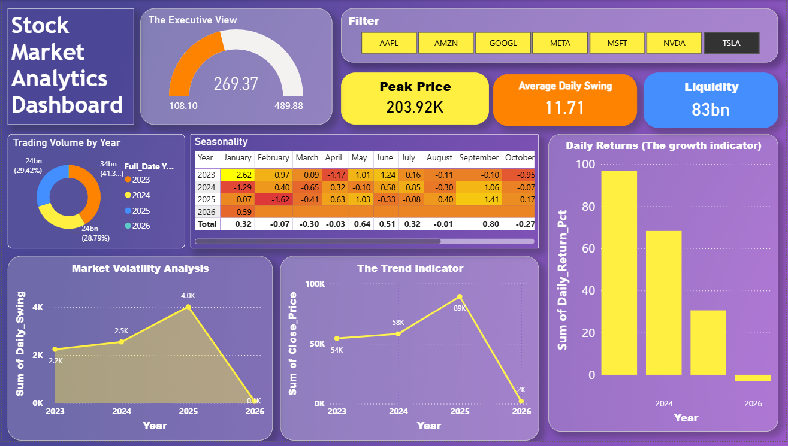

# 📈 Automated Stock Market Data Warehouse

A comprehensive Data Engineering project that automates the extraction, transformation, and loading (ETL) of real-time stock market data into a structured **Star Schema** Data Warehouse.

## 📌 Project Overview
This project builds a robust pipeline to track the "Magnificent 7" tech stocks (Apple, Microsoft, Google, etc.). It demonstrates end-to-end data engineering skills, from raw API extraction to database modeling and visualization.

**Key Features:**
* **ETL Pipeline:** Automated Python script to fetch data via `yfinance`.
* **Data Modeling:** Designed a **Star Schema** (Fact & Dimension tables) optimized for analytics.
* **Data Warehouse:** Implemented in **MySQL** for scalable storage.
* **Visualization:** Matplotlib integration to generate trend charts from the warehouse.

## 🛠️ Tech Stack
* **Language:** Python 3.10+
* **Libraries:** `pandas`, `yfinance`, `mysql-connector-python`, `matplotlib`
* **Database:** MySQL Server 8.0
* **Tools:** MySQL Workbench, Power BI, VS Code

## ⚙️ Database Schema
The Data Warehouse uses a **Star Schema** design:
* **`Fact_Stock_Prices`**: Contains quantitative data (Open, Close, Volume, etc.).
* **`Dim_Stock_Info`**: Stores company metadata (Sector, Industry).
* **`Dim_Date`**: Handles time-series intelligence (Quarters, Weekends).

## 🧠 Data Analysis & Insights
This project goes beyond simple storage; it enables complex financial analysis.

## 📊 Dashboard Preview
Here is the interactive Power BI dashboard visualizing stock trends, risk (volatility), and trading volume.

### 🎥 Dashboard Demo

